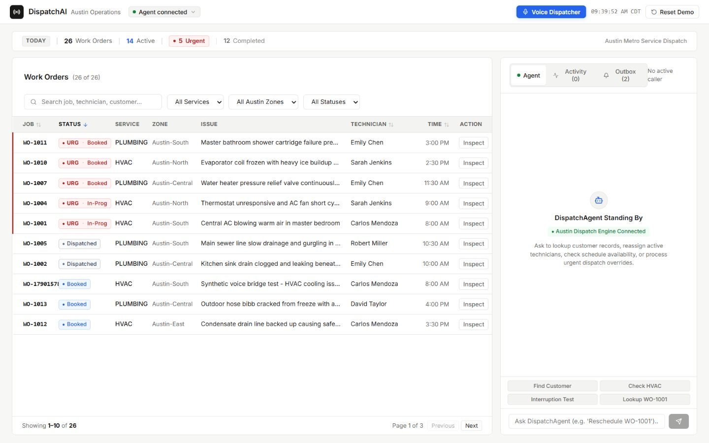
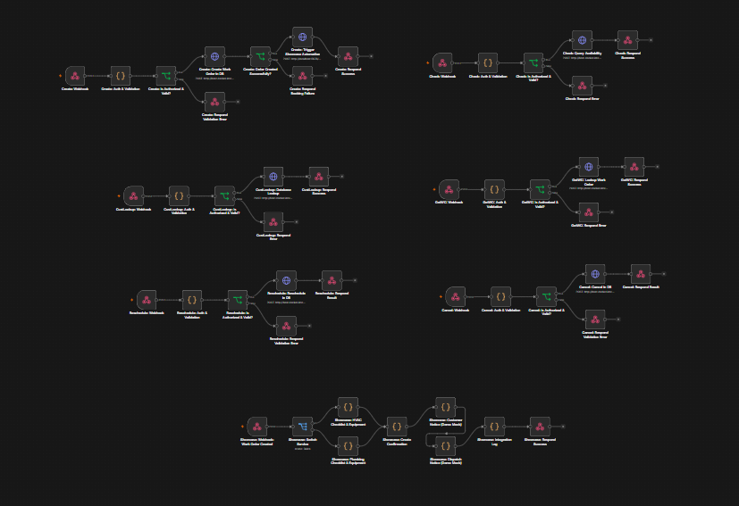

# DispatchAI


**Voice-assisted dispatch for HVAC and plumbing operations.** DispatchAI brings customer intake, technician availability, work-order scheduling, and dispatcher review into one system. It is a portfolio project built around a realistic Austin, Texas field-service workflow.

The application combines a React operations dashboard, an ElevenLabs conversational voice interface, authenticated n8n workflows, and a TypeScript domain service backed by SQLite. A Cloudflare Agents SDK runtime demonstrates persistent agent state and a private path from a Worker to local n8n.

## Product preview

### Operations dashboard



### Workflow orchestration



The merged n8n canvas contains seven flows: create work order, check availability, find customer, get work order, reschedule, cancel, and booking-created automation. Open the image at full size to inspect the connections.

## How it works

```text
Dispatcher dashboard ─┐
                      ├─→ DispatchAgent API ─→ authenticated n8n webhooks
ElevenLabs voice call ─┘                              │
                                                      ▼
                                       Domain service + SQLite
                                                      │
                                                      ▼
                                       Work orders + local outbox

Cloudflare Agents SDK Worker ─→ private Tunnel/VPC path ─→ local n8n
```

The dashboard and voice interface use the local DispatchAgent API. Read tools retrieve customer, job, and availability data; create, reschedule, and cancel operations require explicit confirmation. n8n orchestrates the requests, while the domain service owns booking rules, persistence, idempotency, and the notification outbox. The Cloudflare Worker is a separate Agents SDK integration path, not the current dashboard API.

## Engineering highlights

- **Grounded operations:** Customer and schedule answers come from tool results rather than generated records.
- **Booking safeguards:** Confirmation before mutations, idempotency keys for repeated requests, and slot-conflict checks.
- **Persistent local state:** SQLite retains work orders and outbox entries across domain-service restarts.
- **Voice integration:** ElevenLabs browser sessions use a server-issued signed URL; the API key remains server-side.
- **Workflow security:** Shared-secret authentication between the agent and n8n, plus signature verification for incoming ElevenLabs webhooks.
- **Cloudflare integration:** A deployed Agents SDK Worker stores session state in a Durable Object and has been smoke-tested over a private Tunnel/VPC connection to local n8n. Its public route is disabled.
- **Automated checks:** Vitest covers contracts, domain rules, workflow topology, agent tools, voice bridge, and failure paths.

## Stack

| Component | Technology |
| --- | --- |
| Dashboard | React, TypeScript, Vite |
| Agent API | TypeScript, Node.js |
| Voice | ElevenLabs Conversational AI |
| Orchestration | n8n |
| Domain and persistence | TypeScript, Zod, SQLite |
| Cloud agent runtime | Cloudflare Agents SDK, Durable Objects, Tunnel/VPC Service |
| Tests | Vitest |

## Run locally

Requires Node.js 24+, npm, Docker Desktop, and a local n8n instance. SQLite uses Node's built-in module; no separate database server is required.

```bash
git clone https://github.com/MAhsaanUllah/DispatchAI.git
cd DispatchAI
npm install
cp .env.example .env
npm run build
```

Set the required values in `.env`, especially `N8N_WEBHOOK_SECRET`. Add `ELEVENLABS_API_KEY` and `ELEVENLABS_AGENT_ID` to enable real voice calls. Never commit `.env`.

Import `n8n/workflows/_merged_all_operations.json` into n8n. Create a Header Auth credential named `x-dispatch-secret` with the value from `.env`'s `N8N_WEBHOOK_SECRET`, attach it to the imported webhook and HTTP nodes, and publish the workflow. The HTTP nodes target `host.docker.internal:3100` when n8n runs in Docker.

Start each service in a separate terminal:

```bash
npm run dev:domain
npm run dev:agent
npm run dev
```

Open the dashboard at [http://localhost:5173](http://localhost:5173). The agent API runs on port `8787`, the domain service on `3100`, and n8n on `5678`. Use `npm test` and `npm run typecheck` to verify the codebase.

### Cloudflare agent path

With the local services and the configured private tunnel running, start `npm run dev:cloudflare` and run `npm run smoke:cloudflare`. This exercises the Agents SDK runtime on local port `8788`, its Durable Object state, and the private route to n8n. The deployed Worker has no public route; this path is an integration demonstration, not an always-on hosted dashboard.

## Project scope and next steps

The local dashboard, operational workflows, database, and agent tool routes form the working demo. The notification outbox records intended messages locally; it does not send SMS or email. Before presenting a live voice demo, rehearse a human-spoken booking and verify its dashboard result. A hosted release would additionally need authenticated public access, always-on n8n and database hosting, backups, and a dashboard cutover to the cloud API.

All names, contact details, technicians, and addresses shown in sample data or screenshots are fictional.
