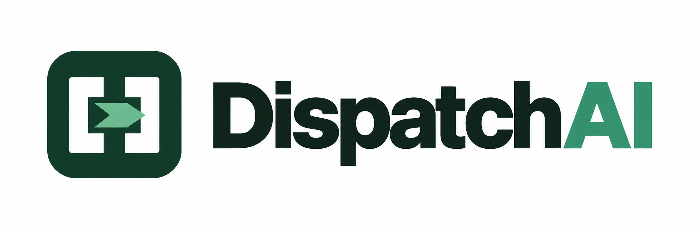
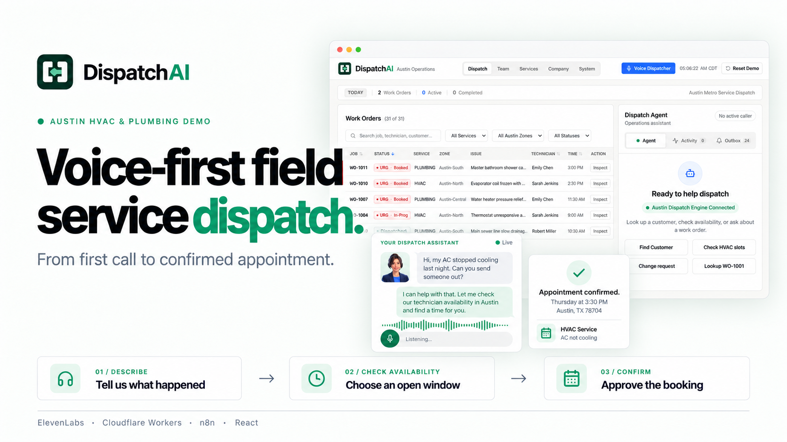
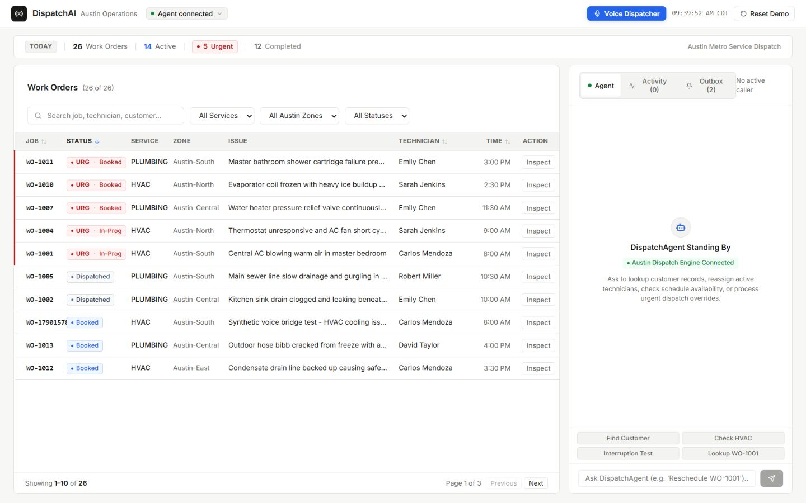
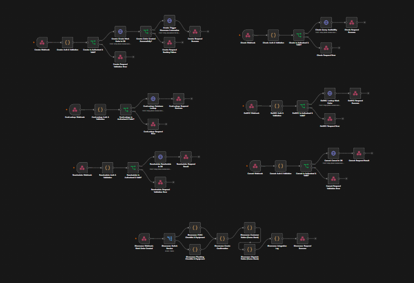

<p align="center">
  
</p>

<p align="center">
  
  
</p>

<p align="center">
  
  
  
  
  
  
  
  
</p>

**Voice-assisted dispatch for HVAC and plumbing operations.** DispatchAI brings customer intake, technician availability, work-order scheduling, and dispatcher review into one system. It is a portfolio project built around a realistic Austin, Texas field-service workflow.

The application combines a React operations dashboard, an ElevenLabs conversational voice interface, authenticated n8n workflows, and TypeScript booking rules. The local server uses SQLite; the deployed Cloudflare Worker now has a separate SQLite-backed Durable Object for demo bookings.

**The hosted Cloudflare demo is invite-only** — access links are shared privately with reviewers. The demo uses synthetic Austin customers, properties, technicians, and schedules; Google sign-in is required before a voice call or opening the cloud dashboard. The selected demo location binds an existing synthetic customer/property on the server; the recruiter's name is conversational context only.

> **Mock data notice:** Everything in the demo and in every screenshot is fictional synthetic sample data. Customers, properties, addresses, phone numbers, technicians, and work orders are invented for the mockup — no real customer or business records are used, and no real dispatch operation is connected.



## Product preview

### Operations dashboard



### Workflow orchestration



The merged n8n canvas contains seven flows: create work order, check availability, find customer, get work order, reschedule, cancel, and booking-created automation. Open the image at full size to inspect the connections.

## How it works

```text
React / Cloudflare web Worker
  → ElevenLabs Conversational AI (signed browser call, six client tools)
  → Cloudflare Agents SDK Worker (stateful conversation and confirmation gate)
  → n8n Cloud operational webhooks
  → Cloudflare SQLite-backed Durable Object business store
  → authenticated, read-only operations dashboard
```

The deployed dashboard reads the Cloudflare business store, not a static preview. Customer lookup and technician availability have been verified through the deployed Agent → n8n Cloud → business-store path. Booking requires an explicit confirmation tool round trip; duplicate-create replay protection returns the original work order. Only the current demo browser session highlights its created work order; the remaining synthetic queue stays visible. No real email is sent.

## Engineering highlights

- **Grounded operations:** Customer and schedule answers come from tool results rather than generated records.
- **Booking safeguards:** Confirmation before mutations, idempotency keys for repeated requests, slot-conflict checks, and protection against duplicate voice-tool booking replays.
- **Multi-turn work-order handling:** Create, look up, reschedule, and cancel a work order across turns while retaining the correct job context; ambiguous references prompt for clarification instead of guessing.
- **Truthful UI and failures:** Dashboard counts, activity, technician details, and connection status reflect available data. Backend outages are reported differently from genuine not-found results.
- **Persistent local state:** SQLite retains work orders and outbox entries across domain-service restarts.
- **Voice integration:** ElevenLabs browser sessions use a server-issued signed URL; the API key remains server-side. The recruiter supplies a display name and synthetic service location, never a fake customer phone or address.
- **Company directory and notifications:** Read-only company, technician, and service views accompany the work-order dashboard. Confirmed bookings enter a persistent notification outbox; optional email delivery requires a configured sender and real recipient.
- **Workflow security:** Shared-secret authentication between the agent and n8n, plus signature verification for incoming ElevenLabs webhooks.
- **Cloudflare integration:** A deployed Agents SDK Worker stores session state in a Durable Object. A second SQLite-backed Durable Object holds shared synthetic booking state behind secret-protected Worker endpoints. A separate Worker hosts the landing page, private invite/Google entry, and live read-only dashboard.
- **Automated checks:** 149 passing tests across 22 files cover contracts, domain rules, workflow topology, agent tools, multi-turn routing, voice-tool replay, pre-call intake, UI states, and failure paths. All four package typechecks pass.

## Stack

| Component | Technology |
| --- | --- |
| Dashboard | React, TypeScript, Vite |
| Agent API | TypeScript, Node.js |
| Voice | ElevenLabs Conversational AI |
| Orchestration | n8n |
| Domain and persistence | TypeScript, Zod, SQLite |
| Cloud agent runtime | Cloudflare Agents SDK, Durable Objects, Tunnel/VPC Service |
| Recruiter web app | Cloudflare Workers Static Assets, React dashboard |
| Tests | Vitest |

### n8n Cloud cutover checklist

The canvas does not need a Cloudflare-branded node: n8n's built-in Cloudflare action is for zone certificates, not this Worker's booking API. The existing HTTP Request nodes are the real integration and can be renamed to make the path visible. Do not add an ElevenLabs node just for a logo: the conversational agent initiates calls outside n8n, and its operational tools must be wired to this flow and voice-tested separately.

In the published merged n8n Cloud workflow, the URL in these six HTTP Request nodes was changed from `http://host.docker.internal:3100` to the deployed Cloudflare agent Worker's public origin, keeping each `/api/internal/...` suffix:

| Canvas node | Worker endpoint |
| --- | --- |
| `Create: Create Work Order in DB` | `/api/internal/create-work-order` |
| `Check: Query Availability` | `/api/internal/check-availability` |
| `CustLookup: Database Lookup` | `/api/internal/find-customer` |
| `GetWO: Lookup Work Order` | `/api/internal/get-work-order` |
| `Reschedule: Reschedule in DB` | `/api/internal/reschedule-work-order` |
| `Cancel: Cancel in DB` | `/api/internal/cancel-work-order` |

Keep the existing Header Auth credential (`x-dispatch-secret`) and JSON body mapping. `Create: Trigger Showcase Automation` uses the **production** webhook URL of `Showcase: Webhook: Work Order Created` on the same n8n Cloud canvas. Customer lookup previously returned a bare `200`; its `Respond Success` node now sends the structured JSON contract. Cloud availability and signed ElevenLabs session checks pass; the final human-spoken voice-to-dashboard journey still needs observation.

## Run locally

Requires Node.js 24+, npm, Docker Desktop, and a local n8n instance. SQLite uses Node's built-in module; no separate database server is required.

```bash
git clone https://github.com/MAhsaanUllah/DispatchAI.git
cd DispatchAI
npm install
cp .env.example .env
npm run build
```

Set the required values in `.env`, especially `N8N_WEBHOOK_SECRET`. Add `ELEVENLABS_API_KEY` and `ELEVENLABS_AGENT_ID` to enable real voice calls. Never commit `.env`.

Import `n8n/workflows/_merged_all_operations.json` into n8n. Create a Header Auth credential named `x-dispatch-secret` with the value from `.env`'s `N8N_WEBHOOK_SECRET`, attach it to the imported webhook and HTTP nodes, and publish the workflow. The HTTP nodes target `host.docker.internal:3100` when n8n runs in Docker.

Start each service in a separate terminal:

```bash
npm run dev:domain
npm run dev:agent
npm run dev
```

Open the local landing page at [http://localhost:5173](http://localhost:5173) and the staff dashboard at `/app`. The agent API runs on port `8787`, the domain service on `3100`, and n8n on `5678`. Use `npm test` and `npm run typecheck` to verify the codebase.

### Cloudflare agent path

The deployed `dispatchai-agent` Worker calls the public authenticated n8n Cloud webhooks and stores conversation state in an Agents SDK Durable Object. The n8n workflows call its secret-protected business endpoints backed by a separate SQLite Durable Object. The browser never receives the n8n secret or ElevenLabs API key.

### Private recruiter flow

The `dispatchai-web` Worker serves the landing page, private Google invite flow, signed ElevenLabs session proxy, and live dashboard. After opening the private invite link, choose a display name and one of three synthetic locations, then continue with Google. The voice session uses six existing ElevenLabs client tools through the Cloudflare Agent and n8n Cloud. Once a confirmed booking succeeds, the current browser session retains its work-order ID and `/app` highlights the real cloud record. The dashboard remains read-only; this is not a production SaaS or real dispatch service.

## Project scope and next steps

Email delivery is intentionally off for the synthetic recruiter demo. The final human-spoken voice-to-dashboard journey should be considered unverified until a real browser call, booking, and dashboard readback are observed together.

All names, contact details, technicians, and addresses shown in sample data or screenshots are fictional.
